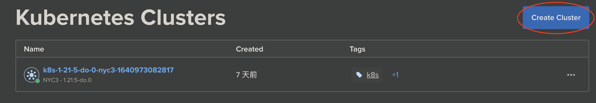
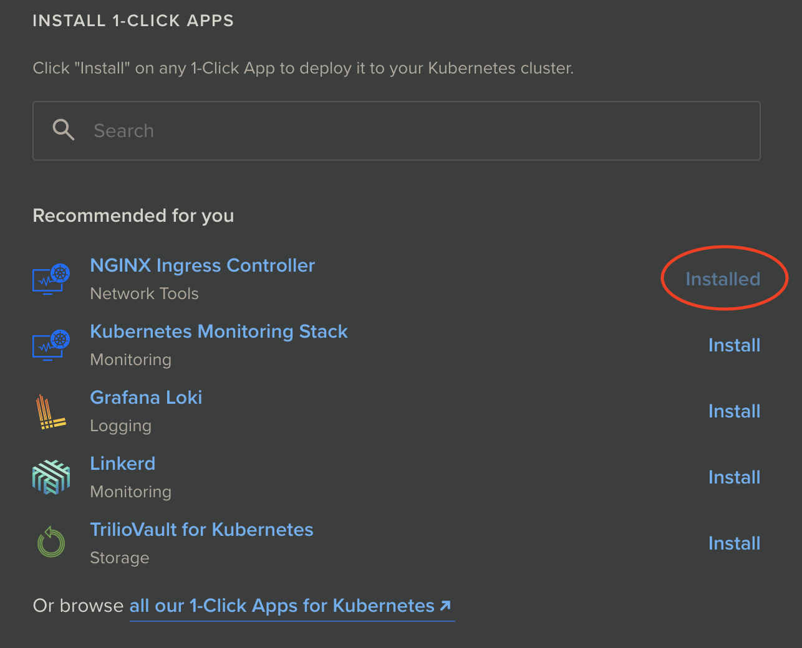
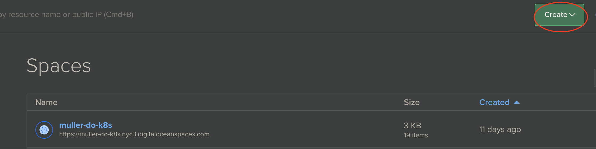
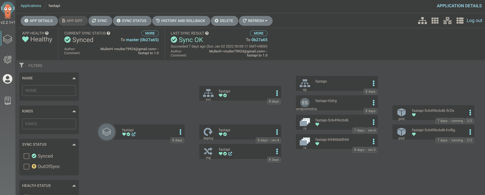
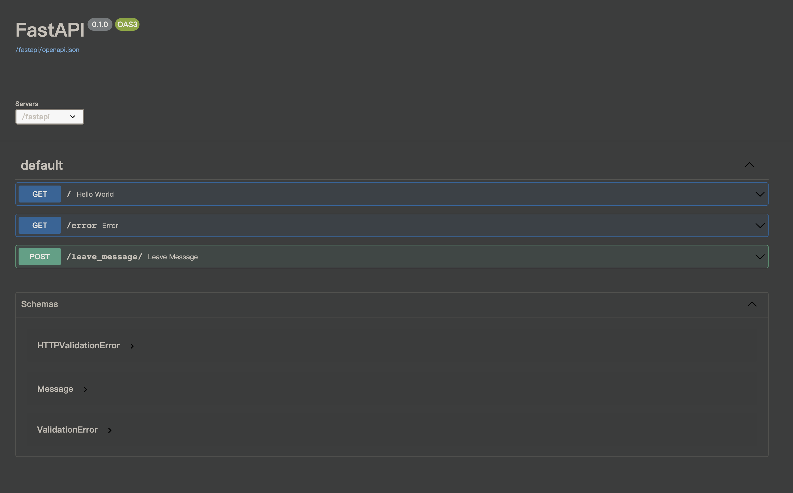
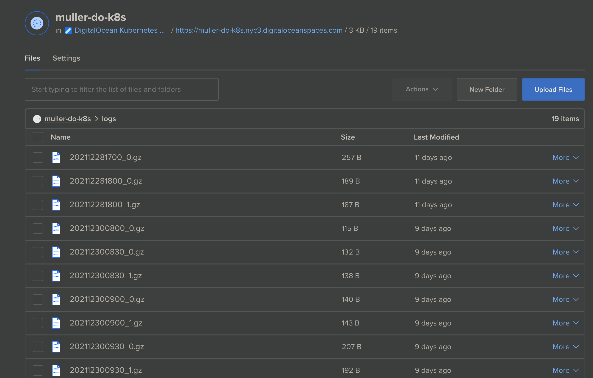

# DigitalOcean Kubernetes Challenge - k8s manifests for ArgoCD

1. Create `DigitalOcean Kubernetes` (DOKS)

    

2. Install `ingress controller` by `1-CLICK APPS`

    

3. Setup `Github actions` for CI

        $ mkdir .github/workflows
        # And then put your CI pipeline.yaml under this folder

4. Setup `ArgoCD` for CD

    https://github.com/TreeKat71/my-k8s-challenge/tree/main/argocd

5. Create bucket for `logs`

    

6. Create secret for fluentd sidecar

        $ kubectl create secret generic fluentd --from-file=fluentd.conf

The fluentd.conf should contain keys for `Spaces` so there should be a way to handle secret. I just put the sample config in the repo. It is better to handle it with `Vault` or sth else.

7. Config `ingress` and `app` for `ArgoCD`

        $ kubectl apply -f argocd/

8. Deploy `fastapi`

    Now, you can manually sync it by clicking button.
    

9. Play around the `fastapi`

    

10. See logs are collected to `Spaces`

    

Found mistakes?
------------
Feel free to contact me through
[email](mailto:muller79924@gmail.com)
in english or chinese.
